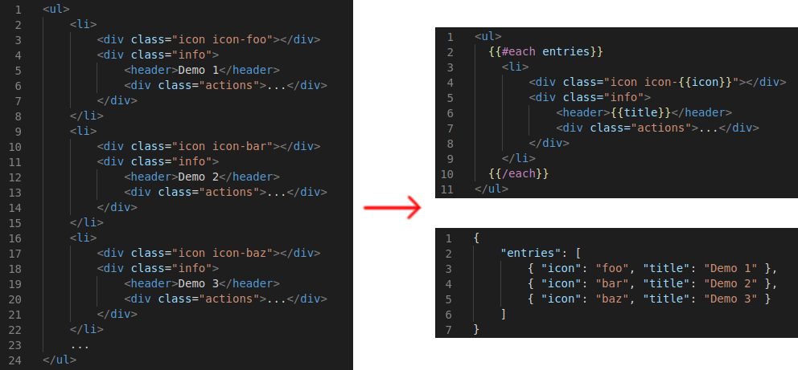
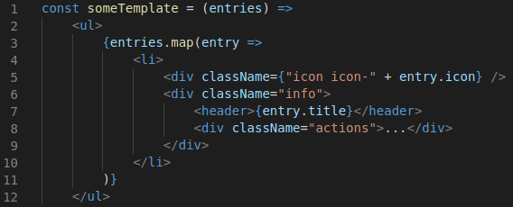
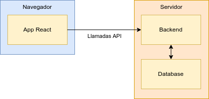

# Introducción

En este tema veremos para qué sirve React, qué diferencias hay respecto a la
forma tradicional de hacer páginas, y dónde encaja en nuestros proyectos.

## Historia

Las primeras webs eran **ficheros estáticos**, generados a mano por los
_webmaster_, y cada vez que se tenían que actualizar, el autor tenía que editar
dichos ficheros y subirlos de nuevo al servidor.

Esto cambió con la llegada de las **webs dinámicas**, que almacenan su contenido
en una *base de datos*, y proporcionan herramientas para editar el contenido
desde la propia página. Ejemplos de esto son Wordpress, Magento, etc..., pero
también sitios como Facebook, Amazon o Idealista.

En una web dinámica tradicional, el HTML de cada página es generado *en el
servidor* cada vez que un usuario accede a ella, cargando los datos desde la
base de datos, y construyendo el HTML a partir de plantillas. Una vez generado,
se envía todo junto al cliente, y el proceso se repite cada vez que se pulse
cualquier enlace o botón.

Esto funciona, pero presenta varios problemas:

- **Cada página contiene todo el HTML**.\
  Si el menú se ve en todas las páginas, tendremos que enviarlo repetido en
  cada una, sin poder almacenarlo en caché. Además, si hay una lista de
  elementos con el mismo formato, el HTML necesario para cada elemento se
  enviará tantas veces como elementos haya. Esto hace la navegación más lenta.

- **Cada página es totalmente independiente**.\
  Cada vez que hacemos click en un enlace, el navegador pide la página nueva, y
  reemplaza la actual por esa. Esto hace que se pierda cualquier información
  que no hayamos enviado al servidor. Además, la transición es muy pobre:
  seguimos viendo la anterior página hasta que, finalmente, desaparece y
  es reemplazada por la nueva. No podemos utilizar indicadores de carga ni
  contenido parcial, con lo que la interactividad es más limitada.

Para mejorar este comportamiento, los navegadores han ido incorporando nuevas
funcionalidades que permiten hacer esto de otras formas.

## Single Page Apps

Con la llegada de **XMLHttpRequest**, podemos enviar y recibir datos del servidor
a través de Javascript, permitiéndonos tomar el control de la navegación,
incluyendo cosas como:

- Cargar datos sólo en el momento que se necesitan (ej: "scroll infinito")
- Dar feedback antes de completar la acción (ej: _spinners_, barras de
  progreso, ...)
- Guardar cambios sin salir de la página

Inicialmente, las páginas eran generadas en el servidor, y al cargar más datos
desde Javascript, se pedía un fragmento de HTML al mismo. Esto mejora la
interactividad, pero no tanto el rendimiento, y a su vez nos crea otras
dificultades nuevas al mezclar contenidos de cliente y servidor.

Por este motivo surgen los lenguajes de plantillas en Javascript. Estos
lenguajes permiten escribir plantillas para transformar datos en HTML, del
mismo modo que hacíamos con PHP en el servidor, pero ahora en el propio
navegador.

Ejemplos: _handlebars_, _mustache_.

|  |
|:--:|
| _Fragmento de HTML, y equivalente con plantillas_ |

Con estas herramientas surge el concepto de _Single Page Application_ o SPA:
una aplicación web formada por una única página, con toda la navegación
gestionada en el cliente vía Javascript, cargando sólo los datos según se
necesitan.

Esta tecnología soluciona los problemas que nos quedaban:

- El servidor sólo necesita enviar los datos, ya que el HTML se genera en el
  navegador.
- Las plantillas pueden cachearse en el cliente, y reutilizarse cada vez que
  se necesiten sin volver a enviar todo el código.

Sin embargo, nos generan nuevos problemas:

- Puede resultar complejo manejar eventos, condicionales, etc...
- Necesitamos aprender un nuevo lenguaje.

Una posible solución es utilizar el propio Javascript para crear las
plantillas, de forma que tengamos toda su expresividad, y podamos seguir
utilizando un lenguaje que ya conocemos. De esta idea surge React.

|  |
|:--:|
| _Plantilla en Javascript_ |

## React

React es una librería para crear interfaces de usuario a partir de componentes
reutilizables escritos en Javascript. Fue creada por Facebook, que la utiliza
en la mayoría de sus páginas (FB, IG, ...), pero ha ido ganando popularidad y
hoy en día existe un amplio ecosistema de librerías independientes que podemos
utilizar en nuestros proyectos.

Existen otras librerías y/o frameworks basados en el mismo concepto, como
Angular o Vue, cada una con sus ventajas y desventajas.

Podemos utilizar React de muchas formas, pero lo más habitual, y lo que veremos
en este bootcamp, es utilizarlo como el motor de nuestra SPA en cliente, y
comunicándonos con un backend a través de una API para cargar los datos.

|  |
|:--:|
| _Arquitectura de una SPA con React_ |

## A continuación...

Continuamos con [cómo crear un proyecto](./02-cra.md).
