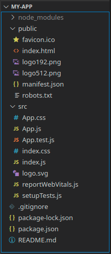

# Crear un proyecto

En este tema veremos cómo crear un proyecto nuevo. Se asume que tenemos
ya instalado Node.js y que tenemos unos conocimientos básicos de línea de
comandos.

## Create React App

Los proyectos React se apoyan en un conjunto de herramientas y configuración
para facilitarnos el desarrollo, y finalmente para generar la página que
enviaremos a los visitantes.

Para simplificar el proceso de iniciar un nuevo proyecto, el equipo de React
creó una herramienta llamada [Create React App](https://create-react-app.dev),
que con sólo un comando nos genera el esqueleto completo de nuestra aplicación,
evitando tener que configurar nada manualmente.

Para crear un nuevo proyecto con CRA, hacemos:

```sh
npx create-react-app demo
```

Donde:
- `npx` es una herramienta de NPM que nos permite ejecutar un paquete
  sin necesidad de instalarlo primero
- `create-react-app` es la herramienta para crear proyectos React
- `demo` es el nombre del proyecto que vamos a crear

Una vez ejecutado, se nos genera una carpeta con el nombre del proyecto, y
nos indica los pasos para arrancarlo.

## Estructura del proyecto

Los proyectos de CRA tienen la siguiente estructura:

|  |
|:--:|
| _Estructura de carpetas_ |

En donde:
- `node_modules` es la carpeta donde npm descarga las dependencias
- `public` contiene ficheros estáticos que no se procesarán, pero serán
  visibles públicamente
- `src` contiene el código de nuestra aplicación
  - `src/index.js` es el fichero que inicia la ejecución
  - `src/App.js` es el componente raíz de la aplicación

## Instalando las dependencias

Si te acabas de **descargar** un proyecto (ej: _al clonar un ejemplo_), antes
de arrancarlo por primera vez, es necesario instalar las dependencias mediante:

```sh
npm install
```

En las siguientes ocasiones no es necesario repetir este comando. Tampoco es
necesario si has creado el proyecto tu, ya que Create React App lo hace por ti.

## Ejecutando el proyecto

Para arrancar nuestra aplicación, tan sólo tenemos que hacer:

```sh
npm start
```

Esto ejecutará el servidor con _hot reloading_, y nos abrirá la página
en nuestro navegador.

Es importante ejecutar este comando desde la raíz de nuestro proyecto; esto
significa, desde donde se encuentra el `package.json`. Si se ejecuta desde
otra carpeta, recibiremos un mensaje de error de npm.

## A continuación...

Una vez tenemos nuestro proyecto listo, es hora de empezar con [JSX](./03-jsx.md).
