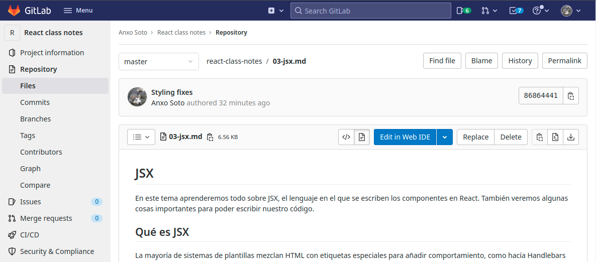

# Componentes

La unidad básica de React son los componentes. En esta lección aprenderemos
qué son y cómo se utilizan.

## Qué es un componente

Los componentes son cada fragmento de interfaz que podemos utilizar en nuestras
aplicaciones. Los componentes a su vez pueden utilizar otros componentes más
pequeños, y colaborar entre si para organizar el funcionamiento de la
aplicación. En última instancia, la aplicación en sí será también un
componente.

Distinguir qué fragmentos merece la pena separar como componentes individuales
es un _arte_ que se aprende con la práctica, y siempre tiene un toque
subjetivo. Veamos un ejemplo:

|  |
|:--:|
| _Aplicación de ejemplo_ |

En un primer paso, podríamos descomponer esta pantalla en 3 componentes:

- Cabecera
- Menú lateral
- Contenido principal

Los dos primeros son claramente componentes ya que se reutilizan en distintos
lugares de la aplicación, y el tercero es el componente asociado a la ruta
en la que estamos.

A continuación podríamos ir descomponiendo más cada uno de estos componentes.
Por ejemplo, en la cabecera podríamos _sacar_ como componentes:
- Menú
- Badge (Icono + número)
- User Info (avatar y desplegable)

En general, dividiremos como componentes las piezas que:
- Se reutilicen en diferentes lugares (ej: Cabecera)
- Tengan una funcionalidad propia _autocontenida_ (ej: User Info)
- Sean demasiado complejos para sumar su código al componente padre
  (ej: Preview del fichero)

No es recomendable dividir tanto que nuestros componentes queden _anémicos_,
pero tampoco es bueno hacer componentes de 500 líneas. Hay que buscar cierto
equilibrio.

## Cómo se crean y usan los componente

Desde un punto de vista técnico, un componente es tan solo una función que
devuelve JSX, y cuyo nombre empieza siempre por **mayúscula**. Por ejemplo,
podemos llamar a un componente `Menu` o `Badge`, pero no ~~`userinfo`~~
(debería ser: `UserInfo`).

A la hora de llamar a un componente, lo utilizamos como si fuese una etiqueta
HTML más dentro de nuestro código JSX:

```jsx
const Menu = () => {
  return (
    <ul className="menu">
      <li>Portada</li>
      <li>Productos</li>
      <li>Contacto</li>
    </ul>
  )
}

const App = () => {
  return (
    <div className="app">
      <Menu />
      <main>...</main>
    </div>
  )
}
```

Si los componentes que vamos a llamar se encuentran en otros ficheros,
deberemos importarlos primero, y para ello deberemos **exportar** cada
componente para que sea accesible desde el exterior.

Este patrón suele ser hacerse de este modo:

```jsx
import Menu from './Menu'
import Badge from './Badge'
import UserInfo from './UserInfo'

const Header = () => {
  // ...
}

export default Header
```

## Props

Los componentes pueden recibir parámetros desde el lugar donde se utilizan.
Para ello, se les pasan como cualquier otro atributo que utilizamos con las
etiquetas HTML:

```jsx
const App = () => {
  return (
    <div className="app">
      <Badge icon="bell" number="9" />
    </div>
  )
```

En el componente, estos parámetros se reciben como un único objeto, el cual
tendrá como key cada nombre de atributo, y como valores sus valores
correspondientes. Este parámetro habitualmente se denomina `props`.

```jsx
const Badge = (props) => {
  return (
    <span className={'icon-' + props.icon}>
      <span className="count">{props.number}</span>
    </span>
  )
}
```

Para simplificar el código, lo más habitual es directamente usar destructuring
para recibir los valores que vamos a utilizar.

```jsx
const Badge = ({ icon, number }) => {
  return (
    <span className={'icon-' + icon}>
      <span className="count">{number}</span>
    </span>
  )
}
```

A través de los props podemos pasar todo tipo de valores, no solo strings.
Es muy frecuente pasar objetos, o incluso funciones.

## Children

Existe un `prop` especial que nos permite recibir los elementos anidados dentro
de la etiqueta de nuestro componente, con el nombre `children`. Se usa así:

```jsx
const Box = ({ children }) => {
  return (
    <div className="box">
      {children}
    </div>
  )
}

const App = () => {
  return (
    <div>
      Vamos a poner algo de contenido en Box
      <Box>
        Esto se recibe en children.
        <p>Incluso puede haber otros tags aquí.</p>
        Todo esto saldrá dentro del div.box.
      </Box>
    </div>
  )
}
```

Este prop es muy útil en cualquier componente presentacional, ya que nos
permite crear componentes que se encargan de envolver cualquier contenido,
añadiendo el comportamiento específico que le corresponde. Por ejemplo,
podríamos crear un componente `<Spoiler>` para envolver fragmentos de texto
que no se podrán ver hasta hacer click para revelarlos.

## A continuación...

Es muy importante comprender a la perfección los componentes para no atascarnos
en los temas más avanzados, ya que son el elemento central de React. Una vez
entendidos, y tras practicarlos suficiente, podemos pasar a ver el manejo de
[eventos](./05-events.md).
